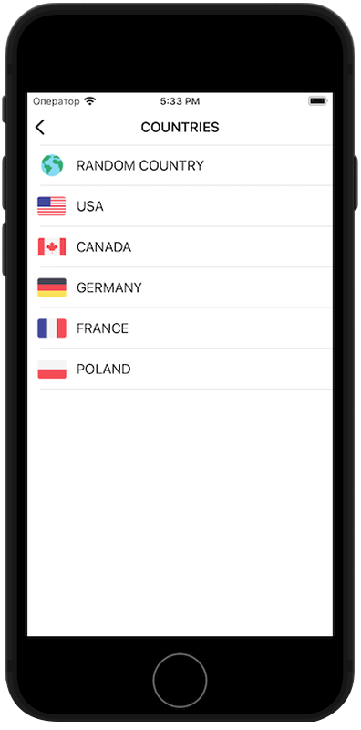

###  __StartVPN__
This is my first app. This app is an OpenVPN client based on Free VPN - [VPNBook](https://www.vpnbook.com/). It was originally written in the MVC architecture, but then I ported it to the Clean Swift architecture.
###### Application stack: 
* UIKit (.xib)
* Clean Swift
* [OpenVPNAdapter Framework](https://github.com/ss-abramchuk/OpenVPNAdapter)
* PacketTunnelProvider
***
###  __Preview__
{width=250px}
{width=250px}
***
###  __Feedback__
Telegram - @Sa1monch
Email - sadyrevdimon@icloud.com
